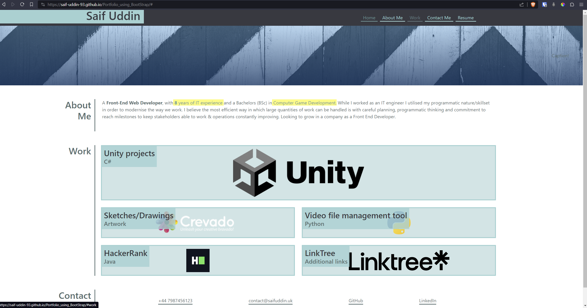

# Portfolio made with BootStrap

## Description
The purpose of this project is to refactor my original portfolio webpage using Bootstrap, to get familiar with the framework. This has been accomplished by implementing bootstrap classes in my HTML elements. Some extra CSS styling has been added to make it look as close as possible to the original portfolio.

Visually and functionally, the end result remains identical to the original version of the webpage, with all changes confined to the HTML and CSS. The primary advantage of these adjustments is to enable other web developers to immediately be able to identify what sections of the webpage have been manipulated with the Bootstrap classes and also be able to make rapid changes by adding or removing the Bootstrap classes.

[Link to BootStrap Portfolio web page.](https://saif-uddin-93.github.io/Portfolio_using_BootStrap)

[Link to Original Portfolio web page.](https://saif-uddin-93.github.io/Saif-Portfolio/)

## Table of Contents
* [Installation](#installation)
* [Usage](#usage)
* [Credits](#credits)
* [License](#license)

## Installation
For this project, the developer tool I'll be using is VS Code. A lightweight IDE that allows working in HTML and CSS. It also allows the use of Extensions which can add extra functionality to the tool to help with debugging and making code more readable. I'll be using Bootstrap by adding the framework using the CDN link in my HTML. The main extension I'll be using is called, Live Server, by Ritwick Dey. The browser that the web page will be used on is Google Chrome and will work on all Chromium-based web browsers.

## Usage
Below is a screenshot of the portfolio using Bootstrap classes:

## Credits
All assets shown on the web page do not belong to me, they were provided by the bootcamp organisers.
The Bootstrap framework is also being used.
The Javascript funtionality for applying the active class to navbar links was added with the help of my Tutor Pratikto. The JavaScript paired with the edited BoostStrap class for "active" are additional touches unrelated to the task for this assignment but added for intuitiveness.

## License
### MIT License

Copyright (c) 2023 Saif-Uddin-93

Permission is hereby granted, free of charge, to any person obtaining a copy
of this software and associated documentation files (the "Software"), to deal
in the Software without restriction, including without limitation the rights
to use, copy, modify, merge, publish, distribute, sublicense, and/or sell
copies of the Software, and to permit persons to whom the Software is
furnished to do so, subject to the following conditions:

The above copyright notice and this permission notice shall be included in all
copies or substantial portions of the Software.

THE SOFTWARE IS PROVIDED "AS IS", WITHOUT WARRANTY OF ANY KIND, EXPRESS OR
IMPLIED, INCLUDING BUT NOT LIMITED TO THE WARRANTIES OF MERCHANTABILITY,
FITNESS FOR A PARTICULAR PURPOSE AND NONINFRINGEMENT. IN NO EVENT SHALL THE
AUTHORS OR COPYRIGHT HOLDERS BE LIABLE FOR ANY CLAIM, DAMAGES OR OTHER
LIABILITY, WHETHER IN AN ACTION OF CONTRACT, TORT OR OTHERWISE, ARISING FROM,
OUT OF OR IN CONNECTION WITH THE SOFTWARE OR THE USE OR OTHER DEALINGS IN THE
SOFTWARE.
